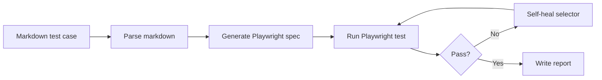

# Playwright ADO Automation Studio

This project demonstrates a simple Playwright workflow for converting Azure DevOps (ADO) test cases or prompt-based requirements into executable browser tests.

## Install
1. Open the project folder in a terminal.
2. Install dependencies:
   - npm install
3. If you want the browser engine available for local execution, install Playwright browsers once:
   - npx playwright install

## Quick start
1. Run the sample OrangeHRM login test:
   - npm test -- --grep "Verify OrangeHRM login with valid credentials"
2. Run the markdown-driven workflow:
   - npm run from-md -- specs/ado-test-case-template.md
3. Or trigger the same flow from VS Code using the task named "Run markdown-to-test workflow".

## How to use the ADO / prompt workflow
1. Open [specs/ado-test-case-template.md](specs/ado-test-case-template.md).
2. Fill in the test case details such as ID, title, URL, steps, and expected results.
3. Save the markdown file.
4. Run the workflow with:
   - npm run from-md -- specs/ado-test-case-template.md
5. The script will generate a Playwright spec under [tests](tests), execute it, and write a report to [playwright-report/markdown-workflow-report.md](playwright-report/markdown-workflow-report.md).
6. If the test fails, the self-healing flow can attempt to recover the selector and rerun the test.

## Workflow diagram

## Current example
- [tests/orangehrm-login-ado.spec.js](tests/orangehrm-login-ado.spec.js)
- [tests/pages/orangehrmLoginPage.js](tests/pages/orangehrmLoginPage.js)
- [specs/ado-test-case-template.md](specs/ado-test-case-template.md)
- [.vscode/tasks.json](.vscode/tasks.json)
